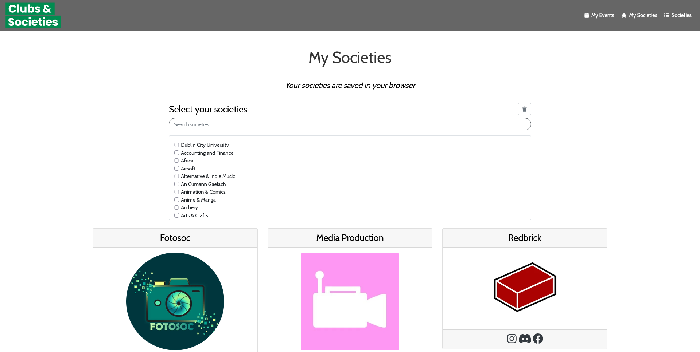
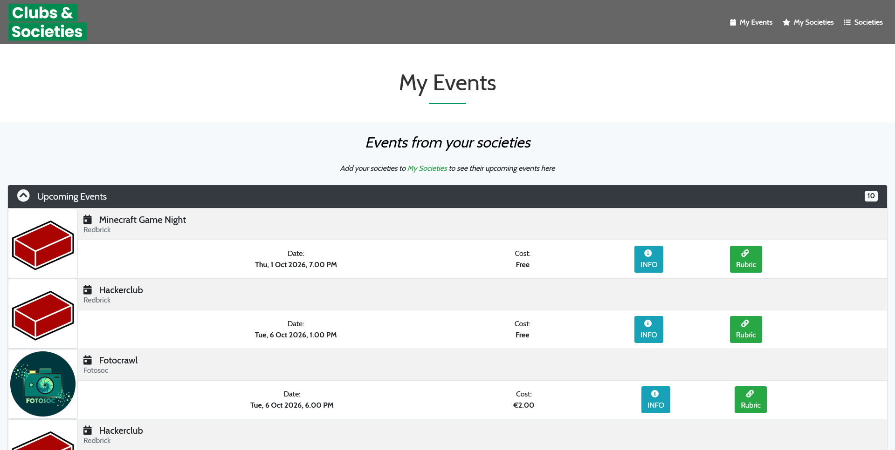
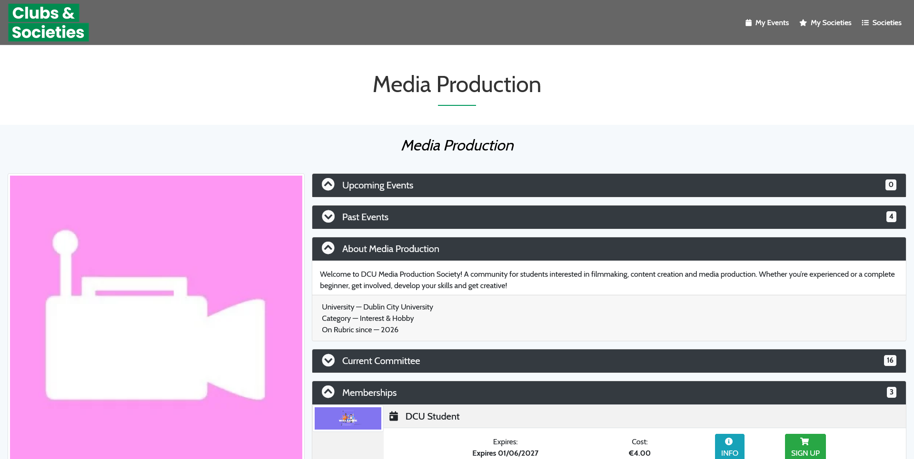

# DCU Clubs & Socs

Bringing the old [dcuclubsandsocs.ie](https://dcuclubsandsocs.jakefarrell.ie) site back to life using Rubric data, complete with new features such as saving your favorite societies and viewing their events on a dashboard.

**Access it here:** [https://dcuclubsandsocs.jakefarrell.ie](https://dcuclubsandsocs.jakefarrell.ie)

## Features

- **Discover Societies**: Browse through all the available clubs and societies at DCU.
- **My Societies**: Select and save your favorite societies to your browser to quickly access their content later.
- **My Events**: View a dashboard of all upcoming and past events hosted by your saved societies.
- **Society Details**: Explore individual societies. View their social links, read their about section, meet the committee, buy memberships, and purchase merchandise.
- **Search & Filter**: Quickly filter through the extensive list of societies with an integrated search bar.

## Screenshots

### 1. Society Selection

*Quickly search, select, and manage your favorite societies.*

### 2. Events Dashboard

*Keep track of upcoming and past events from the societies you follow.*

### 3. Society Detail View

*View links, committee members, memberships, and merchandise for a specific society.*

## Tech Stack

- **Frontend Core**: Vite 
- **Styling & UI**: Assure Memberships
- **Data Source**: Rubric API
- **Local Persistence**: Browser LocalStorage

## Development Guide

1. **Clone the repository:**
   ```bash
   git clone https://github.com/CheeseLad/dcuclubsandsocs.git
   cd dcuclubsandsocs
   ```

2. **Install dependencies:**
   ```bash
   npm install
   ```

3. **Run the development server:**
   ```bash
   npm run dev
   ```
   *The app should now be running on `http://localhost:5173` (or your configured port).*

4. **Build for production:**
   ```bash
   npm run build
   ```
